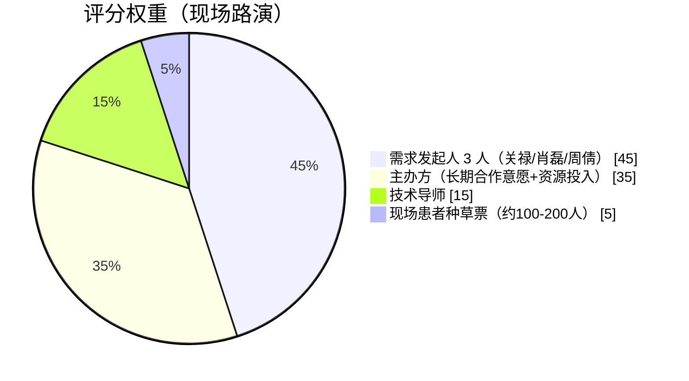

# 2026-10-02 需求对齐会 · 深度解析

> **一句话结论：这场会把「评分规则」和「需求收敛」都摊在桌面上了 —— 技术只占 15%，患者 + 发起人占 50%；需求收敛为「静态室内场景的三件事（放大 / 防抖 / 价格）」；主办方明确硬件不必焦虑、只需给「预算框架」；48 小时路演按「产品发布会」讲、不按技术答辩讲。**
> **而 PathFind 今晚刚上板的无极长按变焦 + 全链路离线 + 双镜头分工，正好逐条命中这份需求。**

| 项 | 内容 |
|---|---|
| 会议 | 白化病低视力 AR+AI 助视眼镜 · 赛题需求对齐会 |
| 时间 | 2026-10-02 20:00–21:45（约 1 小时 45 分） |
| 逐字稿 | `C:\Users\zhouqian\Desktop\20261002195226-AI眼镜-逐字稿文本-1.docx`（约 3.0 万字） |
| 性质 | 赛题发起以来**首次**「需求发起方 × 赛手」坐在一起对齐需求 |
| 落点 | `E:\obsidian\PathFind\2026-10-02_需求对齐会深度解析.md` |
| 相关 | [[需求对照_发起人需求书V1.0]] · [[PRD可交付性结论_能不能实现]] · [[硬件_双镜头分工]] · [[软件方案_评委版]] · [[黑客松_现场应急包]] |

---

## 👥 参会人与角色 —— 先认清谁说话算数

| 人 | 角色 | 权重 |
|---|---|---|
| **兔子 KHub** | 主办方 / 主持人（KHub 平台） | 主持 + 落在「35% 主办方评估」那一档 |
| **关禄** | 白化病病友 · 需求发起者（月亮孩子之家，社群服务十余年，自营助视体验中心） | **45% 评分之一** ⭐ |
| **肖磊** | 白化病病友 · 需求发起者（日常用华为手机 10× 光学 / 50× 数码当助视器） | **45% 评分之一** ⭐ |
| **周倩（会上显示名「金哲」）** | 需求发起者 · 律师 —— **就是你自己** | **45% 评分之一** ⭐ |
| 崔华坤（爱在助视） | 赛手（软件强，正在找可二次开发的 AI 眼镜硬件） | 参赛方 |
| 艾丽（转写作「#」或「海丽」） | 主办方 / 产业导师 | 建议方（本场最有价值的战略建议出自她） |
| 悠然 | 赛手（提问出行障碍场景） | 参赛方 |
| 两位初一学生（13 岁） | 崔华坤小组成员，负责路演材料 | 参赛方 |
| 第二小组（嘉豪 / 汪 / steep） | 赛手 | 本场挂机未发言 |

> ⚠️ **转写误差提示**：逐字稿中「周建 / 周老师」= **周倩**；「艾丽 / 海丽」为同一人；部分发言显示为 `#` 是匿名/未识别发言人。会上提到的时间「半个月后见（杭州）」为线下赛时间。

---

## 🎯 一、最重要的情报：评分规则（决定资源往哪压）

兔子在开场（00:11:29）把评分构成讲得非常直白：



| 维度 | 权重 | 意味着什么 |
|---|---|---|
| **需求发起人 3 人** | **45%** | 关禄、肖磊、周倩三人打分 —— **他们真正想要什么，就是最高权重的问题** |
| **主办方** | **35%** | 评估「我们跟团队长期合作下去的可能性与愿意投入的资源」→ 不只是这次比赛 |
| 技术导师 | 15% | 「非常懂技术的」导师 |
| 现场患者种草票 | 5% | 现场约 100–200 名真实罕见病患者投票 |

### 📌 三条由此推出的战略结论

1. **患者 + 发起人 = 50%，技术只有 15%** → 资源应压在「患者能感知到的价值」上，不是压在最炫的算法上。
2. **35% 是「长期合作意愿」** → 路演要展示的不只是产品，还有**团队能不能被长期投**（能持续迭代、能落地、成本可控）。
3. 兔子原话：「**你们的路演对象更核心，是我们现场近 100 位的罕见病患者**」——不是评委。

---

## 📣 二、路演形式与打分预期（时间已定，打法要改）

| 项 | 会议明确 |
|---|---|
| 形式 | **PPT 展示 + 一个 demo**（让患者现场直观感受交互与功能） |
| 时长 | 每队 **8 分钟路演 + 4 分钟互动答疑 = 12 分钟**（现场可能微调） |
| 讲什么 | 兔子原话：「**现场 200 多个患者听不懂技术方案**，他可能更关注的就是**你在关心我的什么问题**、产品之后会长什么样子、有哪些功能、帮我解决哪些问题」 |
| 怎么理解 | 「**48 小时路演是在做一个产品的介绍、产品的发布会，不需要有太多的技术语言**」 |
| demo 门槛 | 「你哪怕说你拿一个**纸壳子把手机套进去**做了一个可以跟随头颅转向去放大画面的 demo，或者是录制视频，我觉得都可以，**不一定非要把眼镜带到现场**」 |
| 48 小时的真实期待 | **不是埋头写代码**，而是「**建立更多人跟人之间的链接**」——邀请现场其他患者体验、跟产业导师/投资方链接 |
| 备赛节奏 | 兔子建议：**一周内**给三位发起人先做一轮方案/原型展示，听一轮反馈，保证现场前有「大家能先体验一轮」的原型 |

> 💡 **对 PathFind 的直接含义**：`软件方案_评委版` 那套「15 个模型 / 8 步链路」的技术叙事，**不是现场的主菜**。需要另做一版「**产品发布会式**」的 8 分钟讲法（讲场景、讲感受、讲省钱、讲解决什么痛点），技术细节留作 15% 那档的答辩备料。

---

## 🧭 三、需求发起人亲口定的「三条」—— 以及顺序之争

### 3.1 关禄版（00:30:30，他自己的排序）

> 「首先得**看得清**，就是咱说的放大……下来就是得有一定的**抗震和防抖**的能力……刚才说的核心的问题就是**价格**……我觉得就是**价格，看得清，戴得住**，就这样的一个顺序。」

**关禄排序：① 价格 ② 看得清（放大）③ 戴得住（防抖）**

理由（原话）：
- 价格：「目前确实没有特别性价比高的助视器……有的厂商搞了两三年后自己就关门了，因为卖不动」
- 戴得住：「你没有任何防抖，脑袋稍微一个轻微的动作，眼前的画面就左右上下晃，肯定不可能让我们戴得住」

### 3.2 兔子版（01:51 前后的总结）

**① 视觉放大（刚需）② 便携性/重量（不能像宇航员）③ 价格（¥699 左右愿付）④ 防抖（做到一定性能即可，不追高配）⑤ OCR/语音播报（非必要）**

### 3.3 两个版本怎么用

| 结论 | 说明 |
|---|---|
| **「放大」在两版里都是 P0** | 无争议，这是第一刚需（与需求书 V1.0 的「认知修正 1」一致） |
| **「价格」的位次不同** | 关禄把价格排第一，兔子排第三 —— 但**兔子给了具体数字 ¥699**（见下方价格表） |
| **「防抖」两版都在、但都不是第一** | 关禄：「防抖可能相对朝后排一点，**但防抖还是得有**……东西戴上大家半个小时就晕的，实在不行了」 |
| **OCR/朗读明确降级** | 「排在最后的」「前面都实现了，还有精力，还有能力去提供……是最好的，如果没有，也是可以接受的」 |

---

## 📐 四、量化指标清单（本次会议新增/修正，写进需求书 V2 用）

| 指标 | 会上原话 | 来源 | 对照 PathFind 现状 |
|---|---|---|---|
| **放大倍率** | 「我自己感觉到 **10 倍就够了**……最多做到 **12 倍 15 倍就到头**……**不必要再去更高的倍率上去花功夫去做优化**」 | 关禄 00:32:03 | 光学 10× + 数字 1–20× → **正好落在区间内，不必再堆** ✅ |
| **无极变焦** | 「**这个无极变焦是我当时提出来的**……你很多产品变焦的时候是跳跃的……**平滑的过渡**会好很多」 | 关禄 00:34:16 | **今晚刚上板的长按持续变焦** = 连续推镜 + 数字 1×/s ✅✅ |
| **防抖延迟** | 崔华坤方案给 1 秒 → 关禄：「**1 秒的话会不会有点太高了？几百毫秒什么的是不是可以**」 | 关禄 ~00:59:30 | 我们的 EIS 是**实时**（不引入延迟），比 1 秒方案更优 ✅ |
| **稳定注视时间** | 「一定得有注视窗口 **1/10 秒**……**当时是我随便提的**，具体秒数得再找文献；**眼震这次不用作为特别关注点**」 | 关禄 00:35:35 | 我们的「锁帧（稳 1.2s 冻结 / 8s 刷新）」正好命中 ✅ |
| **亮度调节** | 「眼镜一定得有**亮度对比度的调节**功能……**标配**……最好能**10 级或 20 级**的亮度，调节级别更细腻一点」 | 关禄 00:37:48 | 现有 6 大模式 + 21 色彩模式，需核对是否支持连续亮度分级 ⚠️ |
| **续航** | 「续航也是**一定要时间够久**，之前我们见过很多产品都是**两三个小时**就没」 | 关禄 00:41:31 | 无电池（硬伤），现有 LB350E 电池组可支撑 ~6–7.5h ⚠️ |
| **遮光** | 「工作的时候把后边给它**搞成黑的**」——电致变色液晶 / 两个磁吸片全遮盖 | 关禄 00:25:29 | 只有软件压暗，**无物理件** ❌（已定位为最便宜可补项） |
| **重量/形态** | 周倩：乐奇 70 多克「我就觉得重了」；Dream Glass 100 多克 | 01:34 | 雷鸟 Air 3S Pro 形态 ✓，摄像头未上头 ⚠️ |
| **FOV** | 关禄期待「**50 度以上，甚至 70 度**」；肖磊：「AR 目前最高就是 57–59」；某国产厂索尼光机做到 **53°**，后为降本反向缩到 40 多度 | 00:43:33 / 肖磊 00:44:21 | 雷鸟实测约 30–40° → **FOV 是现有硬件的先天短板** ⚠️ |
| **交互** | 「现在蓝牙的叫什么**指环**？我觉得也可以……跟手环/手腕相结合」 | 关禄 00:40:58 / 01:16 | **我们正在做自研指环**（C3 BLE HID，配件在路上）✅✅ |
| **静音/隐私** | 「你最好能够让他**静音**……或者**骨传导**，或者**支持蓝牙耳机**……不能说你直接搞一个哔的声音关不掉」 | 关禄 00:41:31 | 现有 TTS 可静音（需确认默认策略） ⚠️ |
| **联网与否** | 「**首先它基础功能是不需要联网**」「**这三天我们完全做一个离线的就 ok 了**」 | 关禄 00:49:03 | **全链路离线已闭环**（piper / OCR-NPU / Vosk / 家长端）✅✅ |

---

## 💰 五、价格：三个数字，一条隐形线

会上出现了**三个价格参照**，性质完全不同，必须分开看：

| 数字 | 出处 | 性质 |
|---|---|---|
| **¥699 左右** | 兔子总结「患者比较愿意去承担跟付费的价格的区间」 | ⚠️ **患者意愿价**（原话如此，建议向需求书 V2 求证口径） |
| **¥5,000–6,000** | 关禄打麻将场景：「价格如果控制在 5000~6000，那他肯定就愿意买」 | **成年人（非学生）愿付上限** |
| **1 万–5 万** | 关禄：「最便宜也得是 5 位数、1 万出头，还是国产；进口的都卖 3 万、4 万、5 万」 | **现状市场价**（也是最大的机会缺口） |

**关禄的痛点原话**：国内某「翠鸟」产品最便宜 **2 万块**，配套的是一个**电视遥控器**，放大缩小时「**画面还是跳跃的**」；重量 200 克。

> 🔗 与我们已有的 [[同类助视器具成本分析_高中低三档]] 完全对得上：**国内「电子助视器」官方心理价位被钉在 ¥750–2,500**，想进政府采购必须低于它。而我们的演示机 ≈¥3,400–3,700 —— **价格是这场的最大落差项**。

**但有个重要的对冲**（兔子 01:20 原话）：

> 「硬件方面大家**不用有太大压力和担心**……我们对大家的期待是**可以满足经济和便捷性这两个条件**的方案，能够起码让我们看到**有一定的落地性**……**更重要的还是要去测试你们软件部分的功能**。」
> 而主办方要求的硬件交付物是：**「一个初步的设想和预算框架」** —— 找深圳硬件公司按**市场价**调研组装要花多少钱，不能「搞下来上万块钱还炫酷，那不行」。

---

## 🎬 六、场景收敛：从「万能眼镜」收到「静态室内」（本场最大的战略决断）

这一段由**艾丽**（01:06–01:09）提出、**关禄**（01:12:45）确认，是全场最重要的方向性结论：

### 6.1 艾丽的建议：先分场景，别一口吃成胖子

> 「我个人会建议说我们**患者的需求，前阶段还是要把场景分得很清楚**，它可以是**两三个产品解决不同的场景**……一上来就去把所有的场景融在一个产品里……**会拉长很长的战线**」
> 「**先用最笨、最简单、最直接的方式去解决掉**，再把它融在一个大的产品里」

她给的场景切分示例：

| 场景 | 核心诉求 |
|---|---|
| **学生上课场景** | 续航、稳定、**放大的便捷效率** |
| 户外场景 | 安全性、测距、提示 |

### 6.2 关禄的确认：这次就聚焦静态

> 「咱们这次的助视器，我觉得**首先还是要聚焦在这些方面**——目前现有市售产品价格都太高……**聚焦到学生**」
> 「（动态的）玻璃、台阶这些判断，**不是咱这三天就要实现**……我们也很理解现有技术、硬件、软件、续航包括价格是没法达到的，**还是先搞室内的这些，特别是阅读**，不管是黑板还是书籍写字、电脑」

**收敛后的目标场景（三个，全部静态）：**

```
① 教室看黑板（远，需要 10× 光学）
② 家里/教室看书写字（近，需要宽视场+微距）
③ 电脑/手机投屏（加分项：眼前 100 寸屏，但要能放大调节 + 随头转看不同区域）
```

**明确「不做/后置」的**：玻璃门、台阶、障碍物提醒、公交牌/车牌识别、导航牌、找座位号 —— **全部是加分项，不是这次目标**（关禄：动态需求「我们希望它有功能，但很理解达不到」）。

### 6.3 行业印证

> 「大家为什么没有推出一个功能性非常强的 AI 眼镜？像 Meta 最近新出了一个……还有 Rocket 团队……**大家都遇到同一个问题：功能多了，续航差、价格高；功能少了，客户又觉得鸡肋**。他们现在更多的还是希望说**垂直于不同的领域去解决不同的问题**。」

---

## 🛠️ 七、技术讨论：崔华坤的防抖方案与全场共识

### 7.1 崔华坤的思路（赛手视角，可作为我们的对照系）

| 环节 | 他的做法 |
|---|---|
| 放大 | 先用手机放大 → 「放大完之后发现**清晰度其实会比较差**」→ 正在尝试「**用长焦去互补，再用多帧的数据去让它更清晰**」 |
| 防抖 | 试过手机自带防抖（放大到 3 倍后轻微抖动文字仍晃）；现思路：**IMU 检测 ±5° 范围内 → 显示图像「在世界下完全锁定、纹丝不动」**，多帧信息融合到第一帧上 |
| **代价** | 「**会有延迟，老师写了两个字，可能过 1 秒才显示出来**」 |
| 他认为的难点 | ① 相机多是**卷帘快门**（非全局曝光），动态时逐行扫出已有畸变 ② **IMU 与相机无硬件同步、频率不够** → 姿态估计「只要跟相机差个 0.几度，放大 5 倍 10 倍就会造成文字还是会抖」 |

### 7.2 关禄的回应（非常重要，等于给我们的方案盖章）

> 「抖动如果要用软件来控制，**可能会增加延迟，我觉得在一定范围内是可以接受的**……**是不是也可以做成类似于开关的形式**……让用户自己去选择启用不启用稳定……或者做得更人性化一点，比如**侦测到他在看黑板就启用，低头写字就关闭**」
> 「如果真的是 1 秒的话，**会不会就有点太高了？几百毫秒什么的是不是可以**」

> 🎯 **这一条直接命中我们**：我们的防抖是 **EIS 实时稳像（不引入延迟）** + **白化病模式「画面稳定即锁帧」**（稳 1.2s 冻结、8s 强制刷新）—— 关禄说的「开关 / 智能启停」我们可以做，而且**不需要付 1 秒延迟的代价**。

### 7.3 一个被明确的技术共识：**不做透明叠加**

| 观点 | 出处 |
|---|---|
| 「我们**相当于是把真实的环境我就不看了**……类似于一个**纯 VR 眼镜**，前面就是一个黑色的挡光镜片，**我只看放大完的东西**」 | 崔华坤 01:01:36 |
| 「我指的也是真实的景物，也是**通过镜头通过屏幕透视过来的这种模式**……如果是透明镜片把画面叠加上去，**现在延迟怎么都做不到特别低，会产生混乱**」 | 关禄 01:02:46 |
| 「**不用说又可以看到真实的人，又能看到放大的东西，这时候其实会很混乱**」 | 崔华坤 |

→ **形态结论：遮光 + 透视显示（视频穿透），而不是 AR 叠加。** 这正好支持「磁吸挡光片 + 雷鸟屏显」的方案。

### 7.4 硬件选型的共同困境（崔华坤 vs 周倩）

两人都在找「**能二次开发 + 硬件合适 + 价格合适**」的 AI 眼镜，结论都是**找不到**：

| 产品 | 实测问题 | 谁说的 |
|---|---|---|
| 雷鸟 Air 3S Pro | FOV 只有 30–40°（二手 ¥900+）；周倩买的是 **BirdBath 非光波导**的老式款 | 周倩 / 崔华坤 |
| 乐奇（绿字单显） | 70 多克「我就觉得重了」，同事戴了会晕；续航三个多小时（配了磁吸边充仓也不够） | 周倩 |
| Dream Glass | 半头盔式，100 多克，重 | 周倩 |
| Unreal（BirdBath） | FOV 约 50° 较大、支持二次开发，但**二手也要 3000 多** | 崔华坤 |
| 影目（类似 L3） | 配指环控制很方便，但**视场角与屏幕文字太小**，低视力「看起来很费劲」 | 肖磊 |
| 某电子墨镜 | 开放大模式自动变深色、关闭变透明，但**找不到既合适又支持二次开发的** | 崔华坤 |

**晕的机理（崔华坤，专业）**：「辐辏矛盾」——聚焦面与真实双目成像面的深度值不一致，「跟看 3D 电影一样」；**跟重心安排也有关**（重心偏前易累）。

---

## 🧩 八、散落的关键细节（逐条收进需求池）

| # | 内容 | 出处 |
|---|---|---|
| 1 | **眼震不是这次重点** —— 「白化病看到的东西**大部分是不会晃动**的，只有幅度频率特别高的才会」；严重者建议手术。**不要先解决眼震** | 关禄 00:23:35 |
| 2 | **「不是模糊，是细节少」** —— 眼底中心凹发育不良 ≈ 500 万像素 vs 常人 5000 万像素；「你也**不能说 500 万像素的照片是模糊的**」 | 关禄 00:17:36 |
| 3 | **放大 = 用倍率换视野** —— 「0.1 视力给 10 倍放大，细节分辨能力就跟 1.0 视力一样」，代价是视野 | 关禄 00:19:59 |
| 4 | **「我们更喜欢看，而非听」** —— 「看比听的效率要高很多」，视觉辅助 > 听觉辅助 | 关禄 00:21:01 |
| 5 | **年龄下限定在上学（6–7 岁）** —— 未上学不建议长时间用；「头围、重量要求更高，架子要能调大小」 | 关禄 00:49:31 |
| 6 | **屈光校正** —— 白化病常伴远视/近视/散光（±600 度内可校）；「磁吸贴屈光镜片」是最理想形态，但**不排首位** | 关禄 00:25:53 |
| 7 | **人脸识别** —— 加分项：「我们得趴在人脸跟前才能认识张三李四，很多人会说我们见了他们怎么不打招呼」→ 有提示就能主动打招呼 | 关禄 00:29:19 |
| 8 | **投屏** —— 「眼前有个 **100 寸的显示屏**，才能助力我们在电脑上完成工作」；但要能放大调节、**随头转看不同区域** | 关禄 00:42:34 |
| 9 | **抬头/低头自动切倍率** —— 「用户习惯抬头 10 倍、低头 5 倍，有陀螺仪就能检测，抬头调 10 倍、低头调 5 倍」；崔华坤提醒「可能误报，最好有 3D 相机测距」 | 关禄 01:04:51 |
| 10 | **指纹搓麻将场景**（指环的最佳用例）——「指环向上一搓画面放大，向下一拉缩小……我就看见那麻将牌了」 | 关禄 01:16:18 |
| 11 | **出行障碍的真实结论** —— 日常走路/骑车**基本不撞**（不需要细节分辨）；真正的问题是**下台阶**（无立体视易踩空）和玻璃门；外出最大问题是**看车牌/公交牌/找座位**，但频率不高，手机/单筒可替代 | 关禄 01:38:08 |
| 12 | **儿童能不能带手机** —— 很多学生没手机或不能带 → 影响「是否依赖手机」的方案选择（周倩的关切） | 周倩 00:48:00 |
| 13 | **未来交互的想象** —— 脑电波耳机/脑电眼镜（肖磊：「马上要上一个脑电 AI 眼镜」）+「注视某一方位多停留一会儿就自动放大」 | 艾丽 / 肖磊 01:17 |
| 14 | **主办方会带资源** —— 「抱李大维老师的大腿，他会带我们走进整个链条、非常成熟的供应商」；赛后会有供应商走访 | 兔子 01:41:30 |

---

## ✅ 九、对 PathFind 的直接影响：逐条映射（本场最有价值的部分）

把会议结论直接对我们的现状做一次「需求 → 能力」对表：

| 需求（本次会议定稿口径） | PathFind 现状 | 判定 |
|---|---|---|
| 放大 10×，**最多 12–15× 到头，不必更高** | 光学 10× + 数字 1–20× + NPU 超分 | ✅ **正好，不用再堆** |
| **无极变焦**（关禄亲口提） | 今晚刚上板的**长按持续变焦**（光学连续推镜 + 数字 1×/s，松手即停） | ✅✅ **已命中** |
| 防抖**必须有**，延迟**数百毫秒可接受**，最好带**开关/智能启停** | EIS 实时稳像（残余 0.75px / 削减 85%，**不引入延迟**）+ 锁帧「稳 1.2s 冻结」 | ✅✅ **优于会上讨论的 1 秒方案** |
| **基础功能不联网**，这三天做离线就 OK | piper 离线语音 + OCR-NPU 离线 + Vosk 离线 + 家长端本地 —— **双栈断网已实测通过** | ✅✅ **最大契合点** |
| 聚焦**静态室内**（黑板 / 看书 / 投屏） | 双镜头分工：MCL12 长焦看远 + USB 广角看近 | ✅ **天然对口** |
| **指环**交互（搓麻将/放缩） | 自研指环进行中（CSR8510 适配器 ¥26.77 + ESP32-C3 固件骨架已写） | ✅✅ **方向完全一致** |
| **亮度对比度可调，10–20 级更细** | 6 大模式 + 21 色彩模式；**需核对是否有连续亮度分级** | ⚠️ **待核 / 可能要补** |
| **物理遮光**（电致变色或磁吸片） | 只有软件压暗 | ❌ **最便宜可补项**（磁吸片采购即闭环） |
| 续航「够久」（对标 2–3 小时的产品） | LB350E 电池组 → 约 6–7.5h（降压线在途） | ⚠️ **待实测** |
| 价格 / BOM | 演示机 ≈¥3,400–3,700（远超 ¥699 意愿价） | ❌ **但主办方只要「预算框架」** |
| 重量 / 上头形态 | 摄像头未上头；「随头转」未实现 | ⚠️ **形态级工程** |
| FOV | 雷鸟 30–40° | ⚠️ **硬件先天短板**（肖磊：AR 最高 57–59°） |

### 📊 一句话总结这张表

> **这场会对我们「意外地友好」**：需求收敛到**静态室内 + 放大 + 防抖 + 离线 + 无极变焦 + 指环** —— 这正是 PathFind 过去一个月一直在做的方向，而且今晚刚补上「无极长按变焦」这最后一块。
> **真正的缺口只剩三个，且都不在软件**：① 物理遮光片（几天）② 亮度分级（待核，可能几行代码）③ 顶部形态与价格（下一代）。
> **而主办方明确说：硬件不用焦虑，软件功能才是现场重点。**

---

## ⚠️ 十、对 [[需求对照_发起人需求书V1.0]] 的 6 处更新建议

这场会是需求书 V1.0 的**现场讨论版**，几处口径已变，建议在 V2 里更新（也提醒自己以本场口径为准）：

| # | V1.0 里的写法 | 本场口径（更新后） |
|---|---|---|
| 1 | 「等效 >10×」 | 收敛为「**10× 为主，12–15× 到顶，不必再高**」（关禄明确叫停更高倍率优化） |
| 2 | 「4.2 抗震颤防抖」列为差异化核心 | **降序**：放大 > 价格 > 防抖；而**眼震本身本次不作为关注点**（关禄澄清「1/10 秒」是随口提的） |
| 3 | OCR 朗读列入 4.4 验收 | **明确降到 P1**：「排在最后的」，不做也能接受 |
| 4 | 场景未收敛 | **新增场景收敛**：静态室内三场景（黑板 / 看书 / 投屏）为本次目标；动态（玻璃/台阶/车牌/导航）全部后置为加分项 |
| 5 | 延迟未定义 | **新增量化**：防抖引入延迟「**数百毫秒可接受**」（1 秒偏高）；注视窗口「1/10 秒」待文献确认 |
| 6 | 价格带 ¥2,000–3,000 | **新增患者意愿价 ¥699**（兔子口径，待核实）与**成人愿付 ¥5,000–6,000**（关禄口径） |

---

## 🎤 十一、下一步行动项（按「谁能做」分档）

### A. 我现在就能做（无需采购、无需你拍板）

- [ ] **核对亮度对比度分级**：是否支持 10–20 级连续调节（本场新增硬指标）
- [ ] **「稳像开关 + 智能启停」设计**：把「看黑板自动开防抖 / 低头写字自动关」做成可选项（关禄原话需求，我们已有锁帧基础）
- [ ] **做一版「产品发布会式」8 分钟讲法**：替换技术叙事，按「你在关心我什么问题 → 产品和它长什么样 → 解决什么痛点」组织（技术细节留给 15% 答辩）
- [ ] **写「硬件预算框架」**：按市场价给出「磁吸遮光片 + 电池 + 降压缩 + 指环」的组装成本调研表（主办方明确要求的硬件交付物）
- [ ] **抬头/低头自动切倍率**：陀螺仪可用则做，配合「看黑板 10× / 看书 5×」

### B. 需要你拍板 / 采购

| 优先级 | 事项 | 说明 |
|---|---|---|
| ⭐⭐⭐ | **磁吸遮光片** | 关禄列为必需项（「工作的时候必须搞成黑的」），采购即闭环，当前最大且最便宜的缺口 |
| ⭐⭐⭐ | **降压线到货 → 电池链路实测** | 决定「续航到底几小时」，是我们唯一能给的硬数据 |
| ⭐⭐ | 指环配件（适配器 + C3） | 已在途；到货即测，呼应关禄的指环设想 |
| ⭐ | FOV 更好的显示端（如 Unreal 二手 3000+） | 只在预算允许时考虑，非必需 |

### C. 需要外部资源 / 无法自证

- **真人验证**：仍然是全项目唯一真门槛 —— 现在有更好的机会了：**现场有 100–200 位真实患者**，正是拿真实反馈的场合。
- **供应商链路**：赛后由主办方带看（李大维老师资源）。

---

## 🧾 十二、诚实边界（读这份解析前必须知道）

- 本文所有「原话」均来自**机器转写逐字稿**，存在**人名/数字误识别**（如「周建/周老师」=周倩、「艾丽/海丽」同一人、部分发言人显示为 `#`）。引用进正式材料前建议核对原始录音。
- **¥699 这个价格**只在一处出现且是主持人的口头总结，**未见于需求书文字**，请勿直接当成交付指标使用。
- 会上**没有对 PathFind（本组）的方案做任何评价**——崔华坤组是唯一被点名细聊的赛手。本文所有「对照 PathFind」的判断是**我方的自评**，不是需求方的认可。
- 「防抖数百毫秒可接受」是关禄对**崔华坤方案**的回应，不等于他接受**任何**延迟；我们的实时方案仍需真人实测确认。
- 第二小组（嘉豪/汪/steep）本场挂机，其理解可能与本解析有差异。

---

*创建：2026-10-02 22:15 ｜ 类型：会议深度解析（战略情报） ｜ 状态：待需求书 V2 发布后复核*
